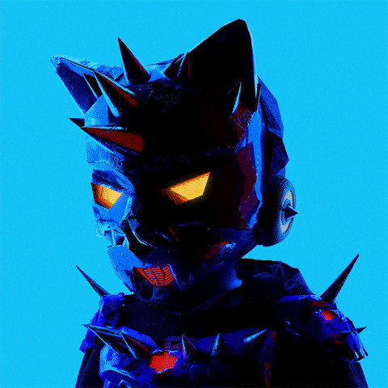

<table border="0">
  <tr>
    <td width="35%" align="center" valign="center">
      
    </td>
    <td width="65%" valign="center">
      <h1>>_ 𝙽𝙸𝚁𝙾𝚂𝙷𝙰𝙽 𝙺.</h1>
      <h3>// Aspiring AI-Driven Quantitative Developer</h3>
      <p>Combining high-performance engineering with deep learning.</p>
    </td>
  </tr>
</table>

<br/>
<p>
  <a href="https://www.linkedin.com/in/niroshan-k">
    
  </a>
  <a href="mailto:lakshanniroshan822@gmail.com">
    
  </a>
</p>

// SYSTEM_STATUS & LOCATION`

```diff
! [CURRENT_LOCATION]: Kandy, Sri Lanka
+ [ROLE]:             CS Undergraduate
# [CURRENT_FOCUS]:    Building ML models from scratch (Math + Code) to grasp the core fundamentals. 
- [GOAL]:             Mastering low-level systems (C++, Rust) for high-speed AI applications.
```
